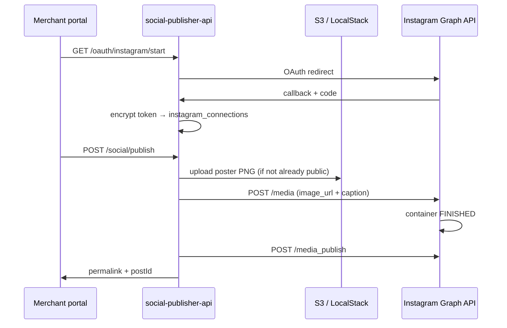

# Module 3 — Instagram Publish Roadmap

> **Status:** Draft + poster + portal preview **done**. This doc is the step-by-step checklist for **OAuth, S3 public URLs, and Instagram publish**.  
> **Service:** `social-publisher-api` (port 8095)  
> **Portal:** `quickmanage-merchant-portal` — Social Publisher modal on menu item page  
> **Reference plan:** [Module3_Social_Publisher_Plan.md](./Module3_Social_Publisher_Plan.md)  
> **Critical path:** Meta App Review (often **2–4 weeks**) before real merchant accounts can publish.

---

## What’s already done


| Area                                               | Status                                           |
| -------------------------------------------------- | ------------------------------------------------ |
| `POST /api/v1/social/draft`                        | Done — caption, hashtags, poster plan            |
| `POST /api/v1/social/draft/:id/regenerate-poster`  | Done — cycle copy variations                     |
| Satori poster render + `GET /posters/:draftId.png` | Done                                             |
| Portal modal (draft, preview, regenerate, copy)    | Done                                             |
| Publish button                                     | Disabled — “Instagram publishing is coming soon” |
| OAuth / publish API                                | Not started                                      |
| S3 poster hosting                                  | **In progress** — LocalStack for local dev       |


---


## Architecture (publish path)




---


## Phase A — Meta app & infra (start now, parallel)

**Goal:** Unblock real merchant publishing via App Review while backend is built.

### A1. Meta Developer App

- [ ] Go to [developers.facebook.com](https://developers.facebook.com) → **Create App** → type **Business**
- [ ] Add products: **Instagram Graph API**, **Facebook Login**
- [ ] Note **App ID** and **App Secret** (store in AWS Secrets Manager in prod; `.env` locally)


### A2. OAuth redirect URIs

Configure in Meta app → Facebook Login → Valid OAuth Redirect URIs:


| Environment | URI                                                                         |
| ----------- | --------------------------------------------------------------------------- |
| Local       | `http://localhost:8095/api/v1/social/oauth/instagram/callback`              |
| Staging     | `https://api-staging.quickmanage.ca/api/v1/social/oauth/instagram/callback` |
| Production  | `https://api.quickmanage.ca/api/v1/social/oauth/instagram/callback`         |


Portal return URL (after connect): e.g. `https://portal.quickmanage.ca/settings/integrations?instagram=connected`

### A3. Required OAuth scopes

```
instagram_basic
instagram_content_publish
pages_show_list
pages_read_engagement
```


### A4. Test Instagram account (dev mode)

- [ ] Create or use a **Facebook Page** + **Instagram Business/Creator** account linked to it
- [ ] Add test users / test Instagram account in Meta app dashboard
- [ ] Verify you can publish manually from Meta’s API Explorer before wiring QuickManage


### A5. Meta App Review (submit early)

- [ ] Record screencast: menu item → brief → draft → edit caption → publish
- [ ] Written justification for `instagram_content_publish` (merchant-initiated marketing posts)
- [ ] Provide test login credentials for reviewers
- [ ] Submit even if publish endpoint is stubbed — review runs in parallel with dev

**While waiting:** build OAuth + publish against test account in dev mode.

### A6. Poster image hosting (S3)

Instagram requires a **public HTTPS** `image_url`. Local `http://localhost:8095/posters/...` will not work for Meta.


| Environment        | Hosting                                                                  |
| ------------------ | ------------------------------------------------------------------------ |
| **Local dev**      | LocalStack S3 (`pnpm run setup:localstack-s3` in `social-publisher-api`) |
| **Staging / prod** | S3 bucket + CloudFront (or public bucket prefix with OAI)                |


- [x] LocalStack S3 bucket + upload on compose (this repo)
- [ ] Real AWS S3 bucket `quickmanage-social-posters` + CloudFront distribution
- [ ] IAM role for `social-publisher-api` EKS pod: `s3:PutObject`, `s3:GetObject` on poster prefix
- [ ] Lifecycle rule: delete objects older than 48h (match `POSTER_RETENTION_HOURS`)


### A7. Secrets (production)

Store in AWS Secrets Manager (see plan doc):

```
AWS_SECRET_META=quickmanage/prod/social-publisher-api/meta
  → META_APP_ID, META_APP_SECRET

INSTAGRAM_TOKEN_ENCRYPTION_KEY  (32-byte hex, AES-256-GCM)
```

---


## Phase B — Backend (`social-publisher-api`)

**Goal:** Connect store → publish draft → audit trail.

### B1. MongoDB collections


#### `instagram_connections`


| Field            | Type   | Notes                              |
| ---------------- | ------ | ---------------------------------- |
| `storeId`        | string | Unique per store                   |
| `igUserId`       | string | Instagram Business account ID      |
| `igUsername`     | string | Display in portal                  |
| `pageId`         | string | Linked Facebook Page ID            |
| `encryptedToken` | string | AES-256-GCM ciphertext (base64)    |
| `tokenIv`        | string | IV (base64)                        |
| `expiresAt`      | Date   | Long-lived token expiry (~60 days) |
| `connectedAt`    | Date   |                                    |
| `updatedAt`      | Date   |                                    |


Indexes: `{ storeId: 1 }` unique.

#### `posts_audit_log`


| Field                                  | Type   | Notes                                                                       |
| -------------------------------------- | ------ | --------------------------------------------------------------------------- |
| `storeId`, `draftId`                   | string |                                                                             |
| `event`                                | enum   | `draft_created`, `draft_edited`, `published`, `publish_failed`, `discarded` |
| `platform`                             | string | `instagram`                                                                 |
| `aiCaption`, `finalCaption`            | string |                                                                             |
| `instagramPostId`, `permalink`         | string | On publish                                                                  |
| `errorMessage`                         | string | On failure                                                                  |
| `model`, `inputTokens`, `outputTokens` |        | From draft                                                                  |
| `timestamp`                            | Date   |                                                                             |


Indexes: `{ storeId: 1, timestamp: -1 }`, `{ draftId: 1 }`.

- [ ] Add Zod types + repos in `src/db/`
- [ ] Run `pnpm run seed:indexes`


### B2. Token encryption

- [ ] `src/utils/crypto.ts` — `encryptToken` / `decryptToken` (AES-256-GCM)
- [ ] `INSTAGRAM_TOKEN_ENCRYPTION_KEY` in env (64 hex chars)
- [ ] Never log plaintext tokens; decrypt only inside publish flow


### B3. OAuth handlers


| Endpoint                                            | Purpose                                                                          |
| --------------------------------------------------- | -------------------------------------------------------------------------------- |
| `GET /api/v1/social/oauth/instagram/start?storeId=` | Redirect to Meta consent; CSRF `state` param                                     |
| `GET /api/v1/social/oauth/instagram/callback`       | Exchange code → long-lived token → encrypt → upsert connection → redirect portal |
| `GET /api/v1/social/connection?storeId=`            | `{ connected, igUsername, expiresAt }`                                           |
| `DELETE /api/v1/social/connection?storeId=`         | Disconnect (optional v1)                                                         |


- [ ] `src/clients/metaOAuthClient.ts` — code exchange, long-lived token, refresh
- [ ] Resolve `igUserId` from Page → connected Instagram account
- [ ] Redirect back to portal with success/error query params


### B4. Instagram Graph client

- [ ] `src/clients/instagramClient.ts`
  1. `POST /{ig-user-id}/media` — `image_url`, `caption`, `access_token`
  2. Poll container status until `FINISHED` (max ~30s)
  3. `POST /{ig-user-id}/media_publish` — `creation_id`
  4. Fetch permalink for published media
- [ ] Handle Graph API errors → `422` with merchant-safe message
- [ ] Log request IDs; never log tokens


### B5. Publish service + endpoint

```http
POST /api/v1/social/publish
Content-Type: application/json

{
  "storeId": "...",
  "draftId": "...",
  "finalCaption": "Merchant-edited caption",
  "platform": "instagram"
}
```

Response:

```json
{
  "postId": "1789...",
  "permalink": "https://www.instagram.com/p/...",
  "publishedAt": "2026-07-10T..."
}
```

- [ ] `src/services/publishService.ts`
- [ ] Load draft; reject if `status === 'published'` (409)
- [ ] Require `instagram_connections` for store (422)
- [ ] Image URL: `posterUrl` if ready, else item `imageUrl`
- [ ] Ensure image is public HTTPS (S3 URL from Phase A6)
- [ ] Caption: `finalCaption + "\n\n" + hashtags.join(" ")`
- [ ] Update `post_drafts.status` → `published`
- [ ] Insert `posts_audit_log` event `published`


### B6. S3 poster upload (local + prod)

- [x] `src/clients/s3PosterClient.ts` — PutObject / GetObject
- [x] Upload after compose when `AWS_S3_POSTER_BUCKET` is set
- [x] `posterUrl` returns S3 public URL when S3 enabled
- [ ] Prod: CloudFront URL in `AWS_S3_POSTER_PUBLIC_URL`
- [ ] Extend `purge:posters` to delete S3 objects (optional)

**Local env (after** `pnpm run setup:localstack-s3`**):**

```bash
S3_ENDPOINT=http://localhost:4566
AWS_REGION=ca-central-1
AWS_ACCESS_KEY_ID=test
AWS_SECRET_ACCESS_KEY=test
AWS_S3_POSTER_BUCKET=quickmanage-social-posters
AWS_S3_POSTER_PREFIX=posters/
AWS_S3_POSTER_PUBLIC_URL=http://localhost:4566/quickmanage-social-posters
```


### B7. Token refresh job

- [ ] Background job or cron: refresh tokens **7 days before** `expiresAt`
- [ ] Meta: `GET /oauth/access_token?grant_type=fb_exchange_token&...`
- [ ] Update `instagram_connections` with new ciphertext + expiry


### B8. Audit logging on draft

- [ ] Fire-and-forget `draft_created` on successful `createDraft`
- [ ] Optional `draft_edited` when portal saves caption changes pre-publish


### B9. Env vars (publish phase)

Add to `.env.example`:

```bash
# Meta / Instagram
META_APP_ID=
META_APP_SECRET=
META_REDIRECT_URI=http://localhost:8095/api/v1/social/oauth/instagram/callback
META_GRAPH_API_VERSION=v21.0
INSTAGRAM_TOKEN_ENCRYPTION_KEY=   # 64 hex chars

# S3 poster hosting
S3_ENDPOINT=http://localhost:4566          # LocalStack only
AWS_S3_POSTER_BUCKET=quickmanage-social-posters
AWS_S3_POSTER_PREFIX=posters/
AWS_S3_POSTER_PUBLIC_URL=http://localhost:4566/quickmanage-social-posters
```


### B10. Testing checklist (backend)

- [ ] OAuth connect with test IG Business account → `connection` returns `connected: true`
- [ ] Create draft → `posterUrl` is S3 URL when bucket configured
- [ ] `curl` S3 URL returns PNG (LocalStack)
- [ ] Publish to test account → permalink opens on Instagram
- [ ] Double publish same draft → 409
- [ ] Publish without connection → 422
- [ ] Expired token → clear error + audit `publish_failed`

---


## Phase C — Portal (`quickmanage-merchant-portal`)

**Goal:** Merchant connects Instagram and publishes from the modal they already have.

### C1. Config + API client

- [ ] `socialPublisher.config.js` — add connection + publish endpoints
- [ ] `socialPublisher.controller.js`:
  - `getInstagramConnection(storeId)`
  - `startInstagramOAuth(storeId)` → window redirect
  - `publishSocialDraft({ storeId, draftId, finalCaption })`


### C2. Connect Instagram UI

- [ ] Settings → Integrations **or** banner in Social Publisher modal
- [ ] “Connect Instagram” → redirect to OAuth start URL
- [ ] Handle return query: `?instagram=connected` / `?instagram=error`
- [ ] Show “Connected as @username” + expiry hint


### C3. Enable Publish button

In `SocialPublisherModal.jsx` / `SocialDraftPreview.jsx`:

- [ ] Fetch connection status when modal opens
- [ ] Enable **Publish to Instagram** when:
  - `VITE_ENABLE_SOCIAL_PUBLISHER=true`
  - `connected === true`
  - draft has `posterUrl` or `imageUrl`
  - caption not empty
- [ ] Send merchant-edited caption as `finalCaption`
- [ ] Loading state + error toast on failure


### C4. Success state

- [ ] Show permalink link: “View on Instagram”
- [ ] Disable re-publish for same draft (or show “Already published”)


### C5. i18n

- [ ] Keys under `social_publisher.*`:
  - `connect_instagram`, `connected_as`, `publish`, `publishing`, `publish_success`, `publish_error`, `not_connected`


### C6. Feature flags

```bash
VITE_ENABLE_SOCIAL_PUBLISHER=true
VITE_SOCIAL_API_BASE=http://localhost:8095/api/v1
```


### C7. Portal testing checklist

- [ ] Modal shows “Connect Instagram” when not connected
- [ ] OAuth round-trip returns to portal with connected state
- [ ] Publish succeeds on test account
- [ ] Error states: not connected, already published, network error

---


## MVP scope boundaries

**In v1:**

- Instagram **feed** posts only (single image + caption)
- One connected account per store
- Publish immediately (no scheduler)
- Human approval required (merchant clicks Publish)

**Defer:**

- Stories, Reels, carousels
- Scheduled posts
- TikTok / other platforms
- Auto-post without merchant click

---


## Recommended execution order

1. **Week 1:** Phase A — Meta app + App Review submission + LocalStack S3 (done locally)
2. **Week 2–3:** Phase B — OAuth + connection API + S3 upload path
3. **Week 3:** Phase B — `instagramClient` + `publishService` on test account
4. **Week 4:** Phase C — portal Connect + Publish button
5. **When App Review approved:** Enable publish for production merchants

---


## Local dev quick start (S3)

```bash
# Terminal 1 — LocalStack (S3)
docker run --rm -p 4566:4566 -e SERVICES=s3 localstack/localstack

# Terminal 2 — create bucket + print .env lines
cd social-publisher-api
pnpm run setup:localstack-s3

# Add printed lines to .env, then:
pnpm dev

# Create a draft — posterUrl should be an S3 path-style URL
curl -X POST http://localhost:8095/api/v1/social/draft \
  -H "Content-Type: application/json" \
  -d '{"storeId":"...","itemId":"...","prompt":"Weekend special"}'
```

> **Note:** Meta cannot fetch `localhost` URLs. LocalStack S3 validates the upload + URL shape; use a Meta **test account** or ngrok/CloudFront for end-to-end publish testing.

---


## Decisions to confirm before coding Phase B/C


| #   | Question                                       | Recommendation                                           |
| --- | ---------------------------------------------- | -------------------------------------------------------- |
| 1   | Connect UI: modal vs Settings?                 | Settings for v1; link from modal                         |
| 2   | Publish poster only or fallback to item photo? | Poster if `ready`, else `imageUrl`                       |
| 3   | Who can publish?                               | Store owners / users with marketing permission           |
| 4   | Real AWS S3 before or after OAuth?             | LocalStack now; real bucket before staging publish tests |


---


## Related docs

- [Module3_Social_Publisher_Plan.md](./Module3_Social_Publisher_Plan.md) — full API contracts, schemas, deployment
- [social-publisher-api/docs/POSTER_RENDERING.md](../social-publisher-api/docs/POSTER_RENDERING.md) — Satori pipeline
- [QuickManage_AI_Architecture.md](./QuickManage_AI_Architecture.md) — platform overview

