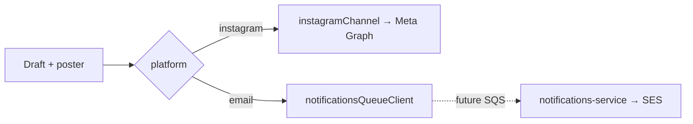

# Module 3 — More Channels Plan (Instagram + Email)

> **Goal:** Extend Social Publisher with **Instagram** (live) and **Email** (queue to notifications-service) — no Facebook for now.  
> **Status:** Phase B done; email = placeholder producer only (no notifications-service changes)  
> **Prerequisite:** [Module3_Anti_Hallucination_Plan.md](./Module3_Anti_Hallucination_Plan.md) (P0–P4 done)  
> **Related:** [Module3_Instagram_Publish_Roadmap.md](./Module3_Instagram_Publish_Roadmap.md)

---

## Scope (current product decision)

| Channel | Status |
|---------|--------|
| **Instagram** | Live publish via channel adapter |
| **Email** | Placeholder in `social-publisher-api` — will SQS → `notifications-service` later |
| Facebook / LinkedIn / TikTok | **Out of scope** for now |

Email reuses draft caption + poster URL; **sending** belongs to notifications-service (same pattern as `ORDER_SUMMARY`).

---

## Architecture



---

## Phase B — Adapter plumbing ✅

- Channel registry: `instagram` + `email`
- IG adapter wraps existing Graph client
- Audit/draft store `platform` + `externalPostId`

---

## Phase C — Email (placeholder now → full later)

### C.1 Placeholder (done — this pass)

| File | Role |
|------|------|
| `src/clients/notificationsQueueClient.ts` | Proposed `SOCIAL_PROMO_EMAIL` envelope; logs; **throws 501** — no SQS send |
| `src/channels/emailChannel.ts` | Publish adapter calling the placeholder |
| `POST /publish` `platform=email` + optional `recipients[]` | Hits 501 until wired |

**No changes to `notifications-service`.**

### C.2 When enabling email (future checklist)

1. **notifications-service:** add event type `SOCIAL_PROMO_EMAIL`, template, SES handler  
2. **social-publisher-api:** add `@aws-sdk/client-sqs`, implement `SendMessage` in `notificationsQueueClient`  
3. Env: `NOTIFICATIONS_QUEUE_URL` (or `AWS_SQS_NOTIFICATION_QUEUE_URL`)  
4. Portal: “Send by email” + recipient picker / audience  
5. Decide: email alone vs Instagram + email for same draft (status model)

### Proposed envelope (producer contract)

```json
{
  "type": "SOCIAL_PROMO_EMAIL",
  "channels": ["email"],
  "idempotencyKey": "social-promo:{draftId}:{email}:0",
  "createdAt": "ISO-8601",
  "recipient": { "email": "guest@example.com" },
  "payload": {
    "store": { "id": "...", "name": null },
    "draft": { "id": "...", "caption": "...", "hashtags": [], "itemTitle": "..." },
    "poster": { "imageUrl": "https://..." }
  },
  "metadata": { "source": "social-publisher-api" }
}
```

---

## Out of scope

- Facebook Page publish  
- Changing notifications-service in this pass  
- Scheduling  

---

## Success criteria

| Case | Expected |
|------|----------|
| `platform` omitted / `instagram` | Live IG publish (unchanged) |
| `platform: "facebook"` | `400` unknown platform |
| `platform: "email"` | `501` placeholder message; payload logged |
| notifications-service | Untouched |
